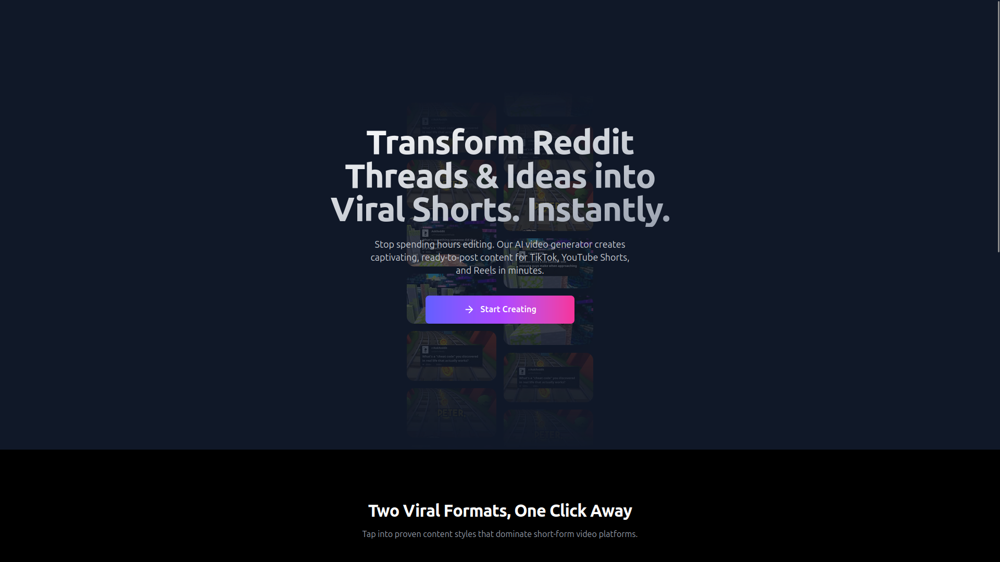
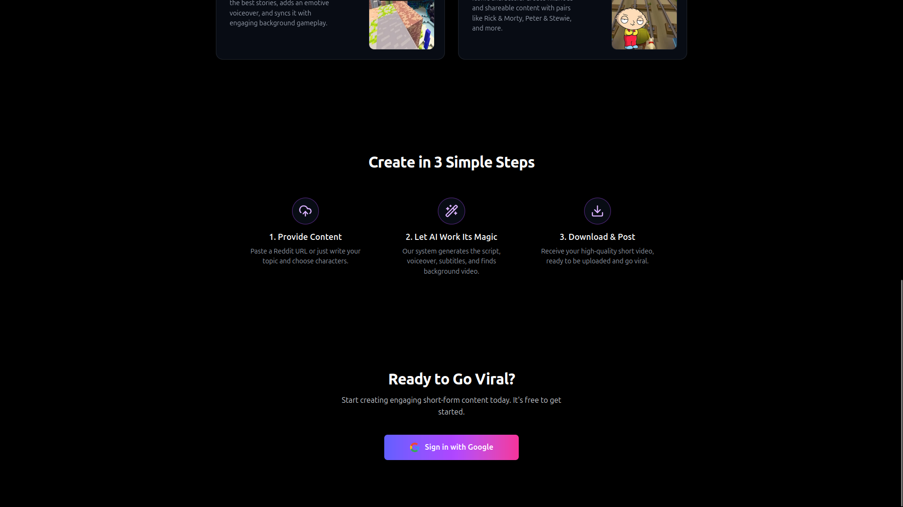
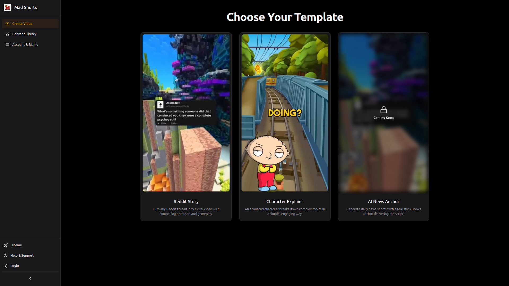
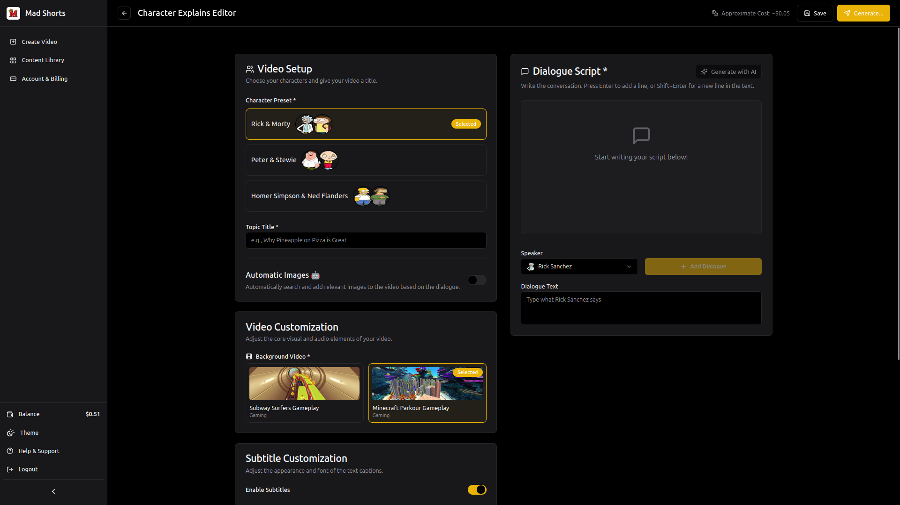
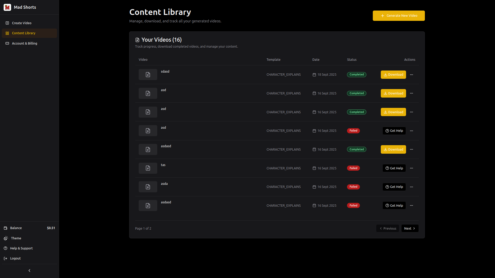
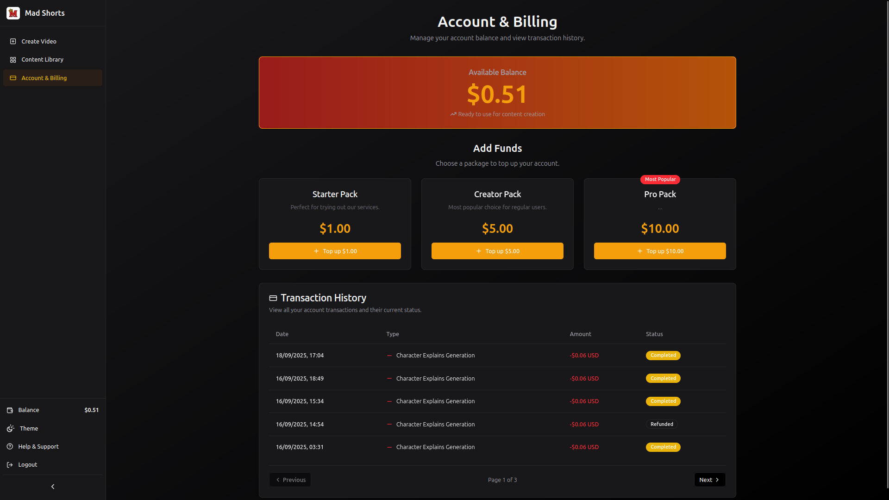

# ShortsCreator 🎬

**Automated Short-Form Content Generation Platform**

A production-ready web application that automates the creation of viral short-form content (TikTok-style Reddit story videos with gameplay backgrounds, AI narration, and audio effects).

[](https://aws.amazon.com)
[](https://nextjs.org)
[](https://spring.io/projects/spring-boot)
[](https://docker.com)
[](https://rabbitmq.com)
[](https://postgresql.org)

## Overview

ShortsCreator streamlines the production of engaging short-form content by automating the entire workflow from content selection to video generation. Users can create viral TikTok-style videos featuring AI-narrated Reddit stories with customizable gameplay backgrounds and audio effects.

### Key Features

- **🤖 AI-Powered Content Generation**: Automated video creation with AI voice narration
- **💰 Monetization Ready**: Integrated payment processing with Stripe
- **⚡ Real-Time Notifications**: Live updates on generation progress and payments
- **🔐 Enterprise Security**: OAuth2/OIDC authentication with Keycloak
- **🎮 Dynamic Backgrounds**: Gameplay footage integration for enhanced engagement
- **🔊 Audio Enhancement**: Smart audio effects and background music
- **☁️ Cloud-Native**: Full AWS deployment with auto-scaling capabilities

## 🏗️ Architecture

### Microservices Architecture
```
                    ┌─────────────────┐
                    │   Next.js Web   │
                    │   Application   │
                    └─────────┬───────┘
                              │
                    ┌─────────┼───────┐
                    │         │       │
                    ▼         ▼       ▼
            ┌──────────────┐  │  ┌──────────┐
            │ API Gateway  │  │  │ Keycloak │
            │(Spring Boot) │  │  │   IdP    │
            └──────┬───────┘  │  └────┬─────┘
                   │          │       │
        ┌──────────┼──────────┼───────┼──────────┐
        │          │          │       │          │
        ▼          ▼          ▼       ▼          ▼
┌─────────────┐ ┌─────────┐ ┌─────────────┐ ┌─────────────┐
│   Content   │ │Payment  │ │Notification │ │   Content   │
│Storage (CSS)│ │Svc (PS) │ │Service (NS) │ │Generation   │
└──────┬──────┘ └────┬────┘ └──────┬──────┘ │Service (CGS)│
       │             │             │        └──────┬──────┘
       │             │             │               │
       └─────────────┼─────────────┼───────────────┘
                     │             │
                     ▼             ▼
              ┌──────────────────────────┐
              │       RabbitMQ           │
              │    Message Broker        │
              └──────────────────────────┘

                     Data Layer
              ┌─────────────┐  ┌─────────────┐
              │ PostgreSQL  │  │  MongoDB    │
              │             │  │             │
              │ • Keycloak  │  │ • CSS Assets│
              │ • Payments  │  │ • Media     │
              └─────────────┘  └─────────────┘
```

### Core Services

#### **API Gateway**
- Centralized routing and request validation and handling

#### **Keycloak**
- Authentication and authorization
- Storage of user data (PostgreSQL) and user event handling

#### **Content Storage Service (CSS)**
- User content management (drafts, generated videos)
- Asset storage integration with AWS S3
- MongoDB for media assets and metadata

#### **Content Generation Service (CGS)**
- AI-powered video generation pipeline
- Reddit content parsing and processing
- Voice synthesis integration using OpenAI and Speechify
- Video orchestration and composition using ffmpeg
- RabbitMQ for asynchronous communication with CSS and PS

#### **Notification Service (NS)**
- Real-time notifications
- Progress tracking for video generations
- Event-driven communication hub

#### **Payment Service (PS)**
- Stripe payment integration
- Usage tracking and billing
- Payment webhook handling
- PostgreSQL for storing transactions and payments

## 🛠️ Technology Stack

### Frontend
- **Next.js 15**: React framework with App Router
- **TypeScript**: Type-safe development
- **Tailwind CSS**: Utility-first styling
- **Framer Motion**: Smooth animations

### Backend
- **Java 21**: Modern Java with virtual threads
- **Spring Boot 3**: Microservices framework
- **Spring Security**: OAuth2/JWT authentication
- **Spring Cloud Gateway**: API routing
- **Maven**: Dependency management

### Infrastructure
- **AWS ECS Fargate**: Serverless container hosting
- **Application Load Balancer**: Traffic distribution
- **RabbitMQ**: Asynchronous messaging
- **PostgreSQL**: Database for storing user metadata and payment related operations
- **MongoDB**: Document storage for metadata of user generated content
- **AWS S3**: Object storage of user generated content and assets
- **Keycloak**: Identity and access management

### DevOps
- **Docker**: Containerization
- **AWS CodePipeline**: CI/CD automation
- **AWS CodeBuild**: Build automation
- **Amazon ECR**: Container registry

## 🚀 AWS Production Architecture

### High Availability & Security
- **Multi-AZ Deployment**: Services distributed across 2 availability zones
- **Private Subnets**: All services isolated from direct internet access
- **VPC Security**: Dedicated Virtual Private Cloud
- **SSL/TLS**: End-to-end encryption with AWS Certificate Manager
- **IAM Roles**: Least-privilege security model

### Auto-Scaling & Performance
- **Fargate Auto-Scaling**: Dynamic scaling based on CPU/memory utilization
- **Application Load Balancer**: Intelligent traffic routing with health checks
- **CloudWatch Monitoring**: Comprehensive logging and metrics

## 🔧 Local Development Setup

### Prerequisites
- Java 21+
- Node.js 22+
- Docker & Docker Compose
- Maven 3.8+

### Quick Start
```bash
# Clone the repository
git clone https://github.com/pedrops164/shortscreator.git
cd shortscreator

# Start infrastructure services
docker-compose up -d

# Backend services
Create .env files and launch backend microsservices 

# Frontend
cd ../frontend
npm install
npm run dev

# Stripe
Run stripe cli with 'stripe listen --forward-to localhost:8081/api/v1/stripe/webhooks'
```

## 📊 CI/CD Pipeline

### Automated Deployment Flow
1. **Source**: Git push on main branch triggers pipeline
2. **Build**: Maven compilation and testing
3. **Docker**: Multi-stage container build
5. **Deploy**: Zero-downtime ECS deployment
6. **Monitor**: Health checks and rollback capability

### Path-Based Triggering
- Changes to `api-gateway/` → Deploy API Gateway only
- Changes to `frontend/` → Deploy Next.js application
- Changes to `shared/` → Deploy all dependent services

## 🔐 Security Features

- **OAuth2/OIDC**: Industry-standard authentication
- **JWT Tokens**: Stateless session management
- **Role-Based Access**: Granular permission system
- **Input Validation**: SQL injection prevention
- **CORS Configuration**: Cross-origin security
- **Secrets Management**: AWS Secrets Manager integration

## 📈 Monitoring & Analytics

- **Application Metrics**: Custom business metrics
- **Infrastructure Monitoring**: CloudWatch integration
- **Error Tracking**: Centralized error logging
- **User Analytics**: Usage patterns and insights

## App Preview

Get a glimpse of the main pages in ShortsCreator:

<div align="center">

### Index page



### Create content pages



### Content page


### Billing page


</div>